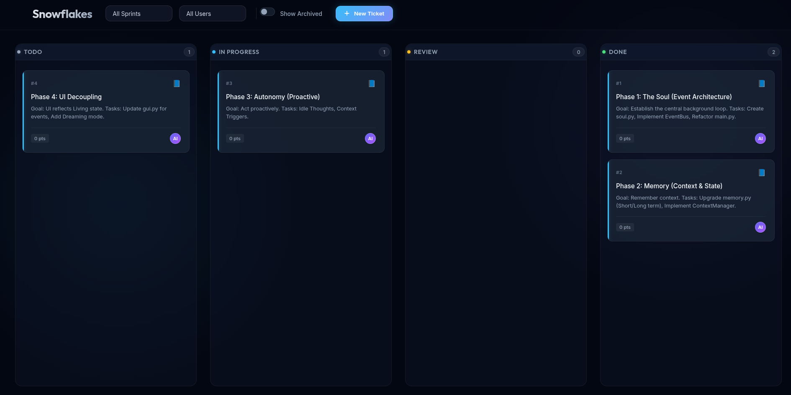

# Snowflakes

A local-first Project Management System bundled as a single binary. It combines a CLI, a Kanban board, a multi-project dashboard, and a JSON-protocol for AI agents into one tool.

The data lives in a `snowflakes.db` SQLite file in your project root. A central registry at `~/.snowflakes/registry.db` tracks all your projects for the dashboard view. No cloud, no login, no setup.



## Installation

### Method 1: Single Binary (Recommended)

Build it once, put it in your path, and use it anywhere.

```bash
# 1. Clone and install dependencies
git clone https://github.com/Maapel/snowflakes-cli.git
cd snowflakes-cli
pip install -r requirements.txt

# 2. Compile to binary
python build.py

# 3. Move to path (Linux/Mac example)
mv dist/snowflakes /usr/local/bin/sw

```

### Method 2: Python

```bash
pip install -r requirements.txt
alias sw="python main.py"

```

## Usage

Snowflakes is designed to be fast. Initialize a board in any directory by running a command.

### CLI Workflow

```bash
# Interactive wizard to create tickets
sw new

# One-line creation (Title is required)
sw new "Fix auth middleware" --type BUG --prio HIGH --assign ai

# List all open tickets
sw list

# View terminal Kanban board
sw board
sw board --sprint "Sprint-1"

```

### Management

```bash
# Start work
sw move 1 IN_PROGRESS

# Assign story points (Fibonacci: 1, 2, 3, 5, 8...)
sw estimate 1 5

# Add to sprint
sw sprint "Sprint-1" 1 2 3

# Close a sprint (moves unfinished tasks to next sprint)
sw close-sprint "Sprint-1" --next-sprint "Sprint-2"

```

### Web UI & Dashboard

Includes a local web interface with a multi-project dashboard and per-ticket chat panel.

```bash
sw start
# Opens http://127.0.0.1:8000
sw stop
# Stops the running UI
```

The web UI has two views:

- **Dashboard** (`#/`): Overview of all registered projects. Each project card shows ticket counts by status and active AI agent work (tickets assigned to `ai` that are TODO, IN_PROGRESS, or REVIEW). Click a card to open its board.
- **Board** (`#/project/{id}`): Kanban board for a specific project with drag-and-drop. Click any ticket to open the slide-out chat panel.

#### Chat Panel

Clicking a ticket on the board opens a slide-out panel on the right with:

- **Details**: Collapsible section to edit title, description, type, and priority.
- **Chat**: A message thread for 2-way communication with AI agents. Messages from `me` appear on the right (blue), messages from `ai` appear on the left (purple). Type a message and press Enter or click Send.

#### Project Registration

Projects are automatically registered in the central registry (`~/.snowflakes/registry.db`) every time you run any `sw` command in a project directory. The dashboard aggregates data from all registered projects.

## AI Integration

Snowflakes exposes project state as machine-readable JSON. This allows AI agents (Cursor, Windsurf, generic scripts) to read the board, pick up tasks, and report progress without hallucinating ticket IDs.

### AI Agent Protocol

To enable an AI agent to use Snowflakes, you can include the following instructions in its system prompt:

**Suggested System Prompt Snippet:**
> You have access to a project management tool called Snowflakes. 
> 1. Run `sw agent-read` to see your assigned tasks and their conversation history.
> 2. Use `sw move <ID> IN_PROGRESS` when starting a task.
> 3. Use `sw comment <ID> <TEXT> --author ai` to ask questions, report blockers, or provide updates.
> 4. Use `sw resolve <ID> --notes <TEXT>` when finished.
> 5. If you need more context on a ticket, use `sw view <ID>`.

#### 1. Reading State (`agent-read`)
Agents should run this to find assigned work. It returns `OPEN` tickets assigned to `ai`, including the **full conversation history** (comments).

```bash
sw agent-read
```

#### 2. Communication & Collaboration
Each ticket has a separate conversation thread. Agents should use this to:
- **Report Blockers:** `sw comment 5 "Missing API documentation for the billing module" --author ai`
- **Provide Updates:** `sw comment 5 "Finished the database migration script" --author ai`
- **Reply to Users:** When a user adds a comment, the agent will see it in the next `agent-read` call and can respond.

#### 3. Execution Workflow
1. `sw agent-read` -> Agent parses JSON tasks + comments.
2. `sw move <ID> IN_PROGRESS` -> Agent signals start.
3. [Agent writes code]
4. `sw comment <ID> "Implemented X, but found a bug in Y" --author ai` -> Optional update.
5. `sw resolve <ID> --notes "Fixed via PR #12"` -> Agent closes ticket.

#### 4. Grooming Backlog (`groom-read`)
Agents can run this to find tasks that need estimation or details (0 points or missing description).

```bash
sw groom-read
```

## Command Reference

| Command | Description | Options |
| :--- | :--- | :--- |
| `new` | Create a new ticket. Interactive by default. | `--type`, `--prio`, `--assign`, `--desc` |
| `edit` | Edit an existing ticket. | `--title`, `--desc`, `--type`, `--prio` |
| `list` | List open tickets. | `--all`, `--sprint`, `--assignee`, `--json` |
| `board` | View the Kanban Board. | `--sprint` |
| `close-sprint` | Close a sprint and migrate tickets. | `--next-sprint` (required) |
| `resolve` | Mark a ticket as DONE. | `--notes` (required) |
| `estimate` | Assign complexity points. | `ID POINTS` |
| `sprint` | Bulk assign tickets to a sprint. | `NAME ID...` |
| `move` | Move a ticket to a new status. | `ID STATUS` |
| `groom-read` | JSON output of unestimated backlog tickets. | |
| `agent-read` | JSON output of AI-assigned OPEN tickets (with comments). | |
| `view` | View ticket details and full conversation. | `ID` |
| `comment` | Add a comment to a ticket conversation. | `ID TEXT`, `--author` |
| `start` | Start the Snowflakes Web UI. | |
| `stop` | Stop the running Snowflakes Web UI. | |

## API Endpoints

The web UI communicates via a REST API. Legacy single-project endpoints are preserved for backward compatibility.

### Project-Scoped Endpoints (New)

| Endpoint | Method | Description |
| :--- | :--- | :--- |
| `/api/projects` | GET | List all registered projects with ticket stats and agent activity |
| `/api/projects/{id}/tickets` | GET | List all tickets for a project |
| `/api/projects/{id}/tickets` | POST | Create a ticket in a project |
| `/api/projects/{id}/tickets/{tid}/move` | POST | Move a ticket's status |
| `/api/projects/{id}/tickets/{tid}/update` | POST | Update a ticket's details |
| `/api/projects/{id}/tickets/{tid}/comments` | GET | Get comments for a ticket |
| `/api/projects/{id}/tickets/{tid}/comments` | POST | Post a comment to a ticket |

### Legacy Endpoints

| Endpoint | Method | Description |
| :--- | :--- | :--- |
| `/api/tickets` | GET/POST | List or create tickets in the current project |
| `/api/tickets/{id}/move` | POST | Move a ticket |
| `/api/tickets/{id}/update` | POST | Update a ticket |
| `/api/tickets/{id}/comments` | GET/POST | Get or post comments |

## Configuration

| Env Variable | Description | Default |
| :--- | :--- | :--- |
| `SNOWFLAKES_ROOT` | Path to the project database file. | Current Working Directory |
| `SNOWFLAKES_STATIC_DIR` | Path to static files for the web UI. | `./static` |
